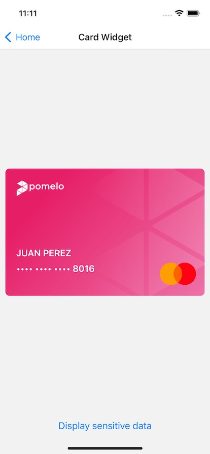
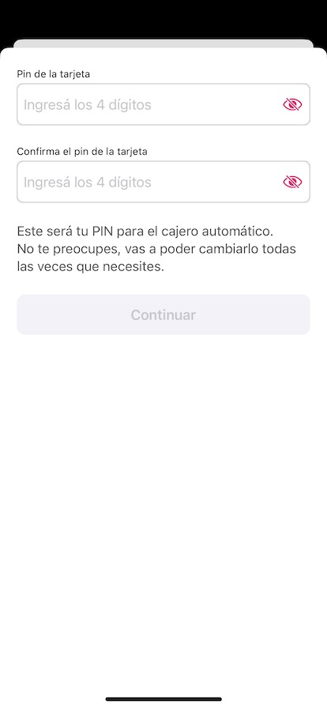

# Getting started

- [Setup Project](#setup)
    - [Setup iOS workspace](#setup-ios)
    - [Setup React Native](#setup-rn)
- [Configuration](#configuration)
    - [Authentication](#authentication)
    - [Theme](#theme)
- [Usage](#usage)
    - [Setup SDK](#setup-sdk)
    - [Card widget](#widget-card)
    - [Card bottom sheet widget](#widget-card-bottom-sheet)
    - [Activate card widget](#widget-activate-card)
    - [Change pin widget](#widget-change-pin)

# Setup Project

In this guide we will explain how to setup iOS PomeloCardsSDK on a React Native project.

## Setup iOS workspace

First you need to add PomeloCardsSDK on the iOS workspace  (ios/ProjectName.xcworkspace) using Swift Package Dependency.

- Select you project, go to `Package Dependencies` and add `git@github.com:pomelo-la/cards-ios.git`


- Setup minimum deployment target to iOS 13.0 or later


- Setup `NSFaceIDUsageDescription` on info.plist with the apropriate message. Ex: `$(PRODUCT_NAME) uses Face ID to validate your identity`


- Drag and drop from the demo project the folder `PomeloReactNativeBridge` to your own ios workspace


Xcode should prompt to add a Bridging-Header file automatically once you drag and drop the files, you must accept it.

If that's not the case you must create it manually. (https://developer.apple.com/documentation/swift/importing-objective-c-into-swift)

 

You must add the imports from the demo project on your Bridging-Header.h so Objective-C code becomes visible to the Swift one.

```
#import "React/RCTBridgeModule.h"
#import "React/RCTViewManager.h"
#import "React/RCTUIManager.h"
#import "RCTSwiftLog.h"
```

## Setup React Native

So we have configured PomeloSDK on the iOS side to make it available on React Native, now we will use it.
 
You need to drag and drop from the demo project the folder `pomelo_native_modules` to your own one.


Now you're all set, you can see examples of how you could call iOS Native Modules on react native side on the demo project.

# Configuration
```
  @objc func setupSDK(_ email: String) {
    //Configure Cards SDK
    PomeloCards.initialize(with: PomeloCardsConfiguration(environment: .staging))
    //Configure authorization service on PomeloNetworking
    PomeloNetworkConfigurator.shared.configure(authorizationService: EndUserTokenAuthorizationService(email: email))
    guaranteeMainThread {
      //Configure theme on PomeloUI
      PomeloUIGateway.shared.configure(theme: PomeloTheme())
    }
  }
```
## Authorization
To initialize Pomelo Cards SDK, we need to provide an end user token. All the logic is implemented in swift on the iOS side, you can check how to do that here: https://github.com/pomelo-la/cards-ios/tree/feature/documentation#3-authorization

## Theme
To customize the iOS theme you should setup your own theme as explained here: https://github.com/pomelo-la/cards-ios/tree/feature/documentation#customizing

# Usage

## Setup SDK
When using the SDK you should first call the setup method from the react native side. This method must be called before launching any widget.
```
const App = () => {
  useEffect(() => {
    NativePomeloCardsModule.setupSDK(constants.email)
  }, []);
```

## Card widget
An example of how you can insert PomeloCardView on a React Native one is shown on `screens/CardWidgetScreen.js`
```
return (
        <SafeAreaView style={styles.container}>
            <PomeloCardView 
                style={styles.card}
                ref={cardViewRef}
                setupParams={{cardholderName:constants.cardholderName, lastFourCardDigits:constants.lastFourCardDigits, image: constants.image}}
                />
              <Button
                onPress={() => showSensitiveData()}
                title="Display sensitive data"
                />
        </SafeAreaView>
    );
```


## Card bottom sheet widget
An example of how to launch card bottom sheet widget is shown on HomeScreen.js
```
    function launchCardListWidget() {
        NativePomeloCardsModule.launchCardListWidget(constants.cardId).then(res => {
            // Sensitive data load successfully
         })
        .catch(e => { alert(`Show sensitive data failed with error: ${e.toString()}`) })
    }
```


## Activate card widget
An example of how to launch activate card widget is shown on HomeScreen.js
```
    function launchActivateCardWidget() {
        NativePomeloCardsModule.launchActivateCardWidget().then(res => {
            // Activate card succeed
         })
        .catch(e => { alert(`Change pin failed with error: ${e.toString()}`) })
    }
```


## Change pin widget
An example of how to launch change pin widget is shown on HomeScreen.js
```
    function launcChangePinWidget() {
        NativePomeloCardsModule.launchChangePinWidget(constants.cardId).then(res => {
            // Pin change succeed
         })
        .catch(e => { alert(`Change pin failed with error: ${e.toString()}`) })
    }
```

