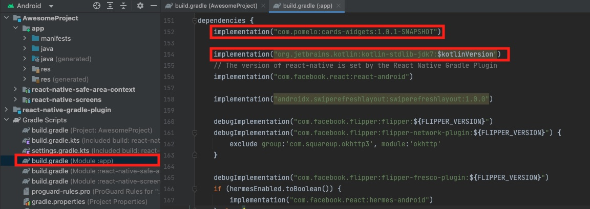
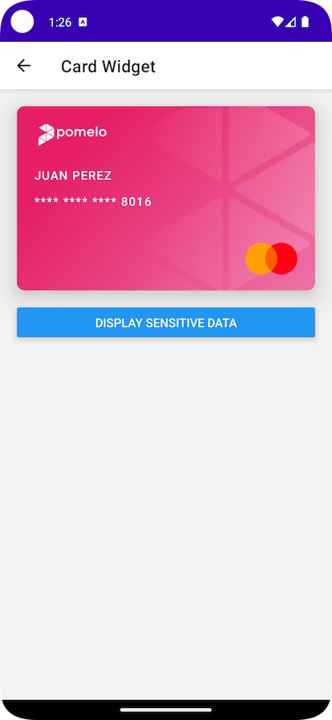
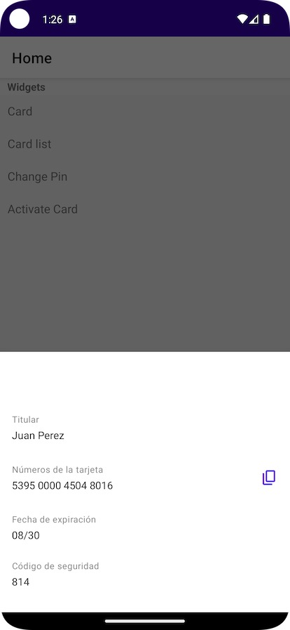
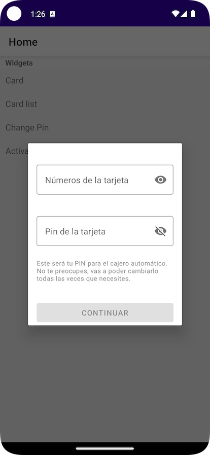
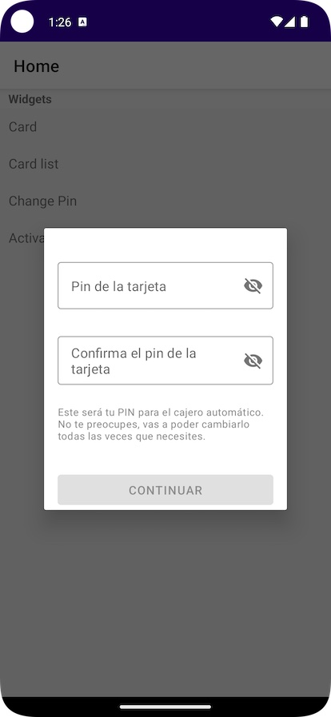

# Getting started

- [Setup Project](#setup-project)
    - [Setup React Native](#setup-react-native)
    - [Setup iOS](#setup-ios)
    - [Setup Android](#setup-android)
- [Configuration](#configuration)
    - [iOS Configuration](#ios-configuration)
        - [iOS Authorization](#ios-authorization)
        - [iOS Theme](#ios-theme)
    - [Android Configuration](#android-configuration)
        - [Android Authorization](#android-authorization)
        - [Android Theme](#android-theme)
- [Usage](#usage)
    - [Setup SDK](#setup-sdk)
    - [Card widget](#card-widget)
    - [Card bottom sheet widget](#card-bottom-sheet-widget)
    - [Activate card widget](#activate-card-widget)
    - [Change pin widget](#change-pin-widget)
- [Roadmap](#roadmap)


# Setup Project

In this guide we will explain how to setup PomeloCardsSDK on a React Native project by implementing a bridge to iOS and Android native SDKs.

## Setup React Native

You need to drag and drop from the demo project the folder `pomelo_native_modules` to your own one.


That's it on react native side, that implements the bridge to the native modules and components. You can check the official React Native documentation if you wan't to know more about this bridge.
https://reactnative.dev/docs/native-modules-intro


## Setup iOS

You need to add PomeloCardsSDK on your iOS workspace  (ios/ProjectName.xcworkspace) using Swift Package Dependency.

- Select you project, go to `Package Dependencies` and add `git@github.com:pomelo-la/cards-ios.git`


- Setup minimum deployment target to iOS 13.0 or later


- Setup `NSFaceIDUsageDescription` on info.plist with the appropriate message. Ex: `$(PRODUCT_NAME) uses Face ID to validate your identity`


- Drag and drop from the demo project the folder `PomeloReactNativeBridge` to your own ios workspace


Xcode should prompt you to add a Bridging-Header file automatically once you drag and drop the files, you must accept it.

If that's not the case you must create it manually. (https://developer.apple.com/documentation/swift/importing-objective-c-into-swift)

 

You must add the imports from the demo project on your Bridging-Header.h so Objective-C code becomes visible to the Swift one.

```
#import "React/RCTBridgeModule.h"
#import "React/RCTViewManager.h"
#import "React/RCTUIManager.h"
#import "RCTSwiftLog.h"
```

## Setup Android

You need to import Pomelo Native Android dependency:

https://github.com/pomelo-la/cards-android-demo#1-import-dependency

1. Setup `settings.gradle`


```
pluginManagement {
    repositories {
        gradlePluginPortal()
        google()
        mavenCentral()
    }
}

dependencyResolutionManagement {
    repositoriesMode.set(RepositoriesMode.PREFER_SETTINGS)
    repositories {
        google()
        mavenCentral()
        maven {
            name = "Pomelo GitHubPackages Releases"
            url = uri("https://maven.pkg.github.com/pomelo-la/android-public")
            credentials {
                username = System.getenv("username")
                password = System.getenv("access_token")
            }
        }
    }
}
```

2. Setup project `build.gradle`


Add kotlin version to the project build.gradle as the bridge is written in kotlin.

`kotlinVersion = '1.6.10'`

`classpath("org.jetbrains.kotlin:kotlin-gradle-plugin:${project.ext.kotlinVersion}")`

3. Setup module `build.gradle`


`apply plugin: "kotlin-android"`


```
buildFeatures {
    buildConfig true
    compose = true
}

composeOptions {
    kotlinCompilerExtensionVersion '1.1.1'
}

flavorDimensions "default"
productFlavors {
    stage {
        dimension = "default"
        buildConfigField("String", "API_BASE_URL", '"https://api-stage.pomelo.la/cards-sdk-be-sample/"')
    }
}
```



`implementation("com.pomelo:cards-widgets:1.0.1-SNAPSHOT")`

`implementation("org.jetbrains.kotlin:kotlin-stdlib-jdk7:$kotlinVersion")`

4. Copy bridge folder to your project

Drag and drop bridge package from the demo project to your own


Replace the module name with your own. Ex: `com.projectname`


5. MainApplication

If your MainApplication is written in Java we need to convert it to Kotlin


`lateinit var userTokenRepository: UserTokenRepository`
```
    override fun getPackages(): List<ReactPackage> {
        val packages: MutableList<ReactPackage> = PackageList(this).packages
        packages.add(PomeloCardsPackage(userTokenRepository))
        return packages
    }
```


```
    startAppKoin()
    userTokenRepository = get()
```
```
    private fun startAppKoin() {
        val modules = listOf(MainModule.initModule())
        GlobalContext.getOrNull()?.apply {
            loadKoinModules(modules)
        } ?: startKoin {
            androidLogger()
            androidContext(this@MainApplication)
            modules(modules)
        }
    }
```

6. Card Image
Add card image to Android `assets` folder


#### Known Android bugs
We currently have a bug that Android App won't work if it doesn't have a Material Theme. We are working to solve it, if this is an issue for you please contact our support team mobile@pomelo.la


# Configuration

## iOS Configuration

When you call the setup method from React Native under the hood iOS is setting the environment, the authorization service and the theme.

```
  @objc func setupSDK(_ email: String) {
    //Configure Cards SDK
    PomeloCards.initialize(with: PomeloCardsConfiguration(environment: .staging))
    //Configure authorization service on PomeloNetworking
    PomeloNetworkConfigurator.shared.configure(authorizationService: EndUserTokenAuthorizationService(email: email))
    guaranteeMainThread {
      //Configure theme on PomeloUI
      PomeloUIGateway.shared.configure(theme: PomeloTheme())
    }
  }
```

### iOS Authorization
To initialize Pomelo Cards SDK, we need to provide an end user token. All the logic is implemented in swift on the iOS side, you can check how to do that on iOS native SDK documentation:

<https://github.com/pomelo-la/cards-ios/tree/feature/documentation#3-authorization>

### iOS Theme
To customize the iOS theme you should setup your own theme. You can check how to do that on iOS native SDK documentation:

<https://github.com/pomelo-la/cards-ios/tree/feature/documentation#customizing>

## Android Configuration

When you call the setup method from React Native under the hood iOS is setting the authorization service.

```
@ReactMethod
fun setupSDK(email: String) {
    val configuration = Configuration {
        userTokenRepository.getUserToken(UserTokenBody(email))
    }
    PomeloCards.register(configuration, reactContext.applicationContext)
}
```

### Android Authorization

To initialize Pomelo Cards SDK, we need to provide an end user token. All the logic is implemented in kotlin on the Android side, you can check how to do that on Androud native SDK documentation:

<https://github.com/pomelo-la/cards-android-demo#3-authorization>

### Android Theme
To customize the Android theme you should setup your own styling. You can check how to do that on Android native SDK documentation:

<https://github.com/pomelo-la/cards-android-demo#styling>

# Usage

## Setup SDK
When using the SDK you should first call the setup method from the react native side. This method must be called before launching any widget.

```
const App = () => {
  useEffect(() => {
    NativePomeloCardsModule.setupSDK(constants.email)
  }, []);
```

## Card widget
An example of how you can insert PomeloCardView on a React Native one is shown on `screens/CardWidgetScreen.js`

```
return (
        <SafeAreaView style={styles.container}>
            <PomeloCardView 
                style={styles.card}
                ref={cardViewRef}
                setupParams={{cardholderName:constants.cardholderName, lastFourCardDigits:constants.lastFourCardDigits, image: constants.image}}
                />
              <Button
                onPress={() => showSensitiveData()}
                title="Display sensitive data"
                />
        </SafeAreaView>
    );
```

iOS                                       |  Android                                 
:----------------------------------------:|:----------------------------------------:
  |  

## Card bottom sheet widget
An example of how to launch card bottom sheet widget is shown on HomeScreen.js
```
    function launchCardListWidget() {
        NativePomeloCardsModule.launchCardListWidget(constants.cardId).then(res => {
            // Sensitive data load successfully
         })
        .catch(e => { alert(`Show sensitive data failed with error: ${e.toString()}`) })
    }
```
iOS                                             |  Android                                 
:----------------------------------------------:|:----------------------------------------------:
  |  

## Activate card widget
An example of how to launch activate card widget is shown on HomeScreen.js
```
    function launchActivateCardWidget() {
        NativePomeloCardsModule.launchActivateCardWidget().then(res => {
            // Activate card succeed
         })
        .catch(e => { alert(`Change pin failed with error: ${e.toString()}`) })
    }
```
iOS                                         |  Android                                 
:------------------------------------------:|:------------------------------------------:
  |  

## Change pin widget
An example of how to launch change pin widget is shown on HomeScreen.js
```
    function launcChangePinWidget() {
        NativePomeloCardsModule.launchChangePinWidget(constants.cardId).then(res => {
            // Pin change succeed
         })
        .catch(e => { alert(`Change pin failed with error: ${e.toString()}`) })
    }
```
iOS                                      |  Android                                 
:---------------------------------------:|:------------------------------------------:
  |  

# Roadmap

We know that currently configuring Pomelo´s SDKs on React Native involves a couple of steps and we would like to improve the experience. We have a couple of goals on track and we would like to listen to your feedback to improve the experience. Please write to mobile@pomelo.la for any suggestions.

- [ ] Setup card images on React Native side.
- [ ] Setup end user token on React Native side.
- [ ] Setup mobile theme from the dashboard.
- [ ] Create a npm package that wrappes both sdks. The dependency will be installed using `npm install react-native-pomelo-cards` and you won't need to edit any native code 🥳🥳🥳

